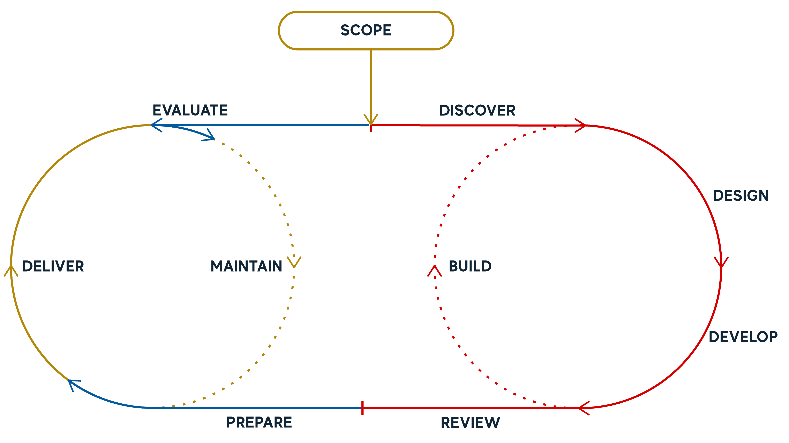

Add in information about our course development process – graphic, list of tools, maybe links to templates and style guide. 

## Course Development Workflow

The Course Development team established and refined a robust workflow for course development throughout the project. This approach provided the required flexibility to work for the diverse set of courses being developed, different staffing requirements and availability, course content and learning experiences and quality assurance requirements. The process became a foundation for the universities broader processes and helped to establish best practices across teams. 

1. **Scope**
The scoping stage captures all the planning and development required outside of a course. This would include program design, graduate experience design, project specifications, etc. It would set the grounding parameters for a course to begin.
2. **Discover**
This is the translation stage between scope, what exists previously, and what needs to happen in the course design process. This would include the development & refinement of CLOs, assessment parameters, program and graduate learning alignment, aims and goals of the course
3. **Design**
Design encompasses the co-creation of the course structure, constructive alignment, assessment tasks, and iterative tasks related to media, content, and activities. This process is cyclical and iterative, building the course in stages, starting with the big picture and adding details as it continues.
4. **Develop**
The creation of the course content and resources. This is adapted to the course specifications in terms of sizing but provides space for concepts to be developed and refined before production.
5. **Build**
The creation of the finalised course materials. Build involves work in the LMS, media production, video and interactive development.
6. **Review**
This would encompass all QA reviews involved in the project – learning design checks, accessibility, UX, student and faculty reviews – as well as the work to remedy these issues and end in a signed-off course ready to deliver.
7. **Prepare**
Time in the process for academics to prepare to teach the course. This time would be best suited to training and capability development as well as the development of additional teaching materials and requirements for course delivery - slides, workshops, and tutorials.
8. **Deliver**
The teaching of the course. Additional support, including troubleshooting, training and technical aspects, may need to be offered.
9. **Evaluate**
The process of reviewing the delivery of a course to seek areas for improvement and development. Uses the SELTs and Learning Analytics to identify issues and tweaks that can be made.
10. **Maintain**
The process of making small improvements to the existing course. These would be minor amendments, tweaks and changes to make the course run more smoothly.